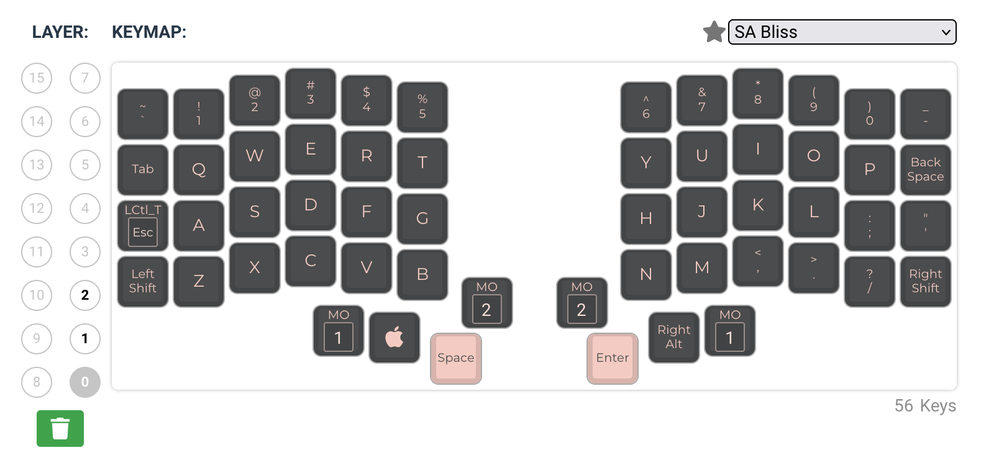
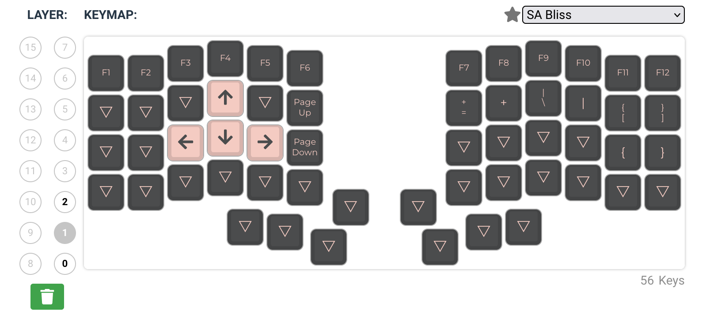
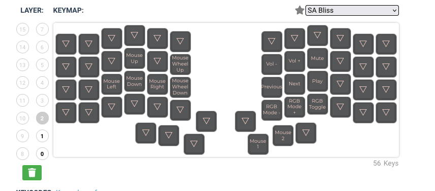

# Personal QMK Firmware 

A forked QMK firmware that contains my configuration:
- Keebio Iris Rev6 (plastic)
- Keebio Iris Rev7 (metal)

## Install QMK CLI

```sh
brew tap qmk/qmk
brew install qmk/qmk/qmk
```

## Configure Keymap

If you haven't done this, follow this steps. I've already done this and everything is located in this directory.

1. Go to [QMK FM](https://config.qmk.fm)
Choose your keyboard, keymap name, download the JSON file, save this for later below. In this repo, it is already located in this directory.

2. Compile JSON to C

   ```sh
   qmk json2c <path/to/keymap.json> -o <path/to/keymap.c>
   ```

3. Add `config.h` and/or `rules.mk` for extra configuration

## Compile

1. Clone this repo

   ```sh
   git clone --recurse-submodules git@github.com:Exegetech/qmk_firmware.git
   ```
  
2. Setup qmk
   
   ```sh
   cd qmk_firmware
   qmk setup -H .
   ```
   
   Answer `Y` to everything.
   
   Verify that it works by running
   
   ```sh
   qmk compile -kb keebio/iris/rev6 -km default
   ```
   
3.  Copy files from the [Configure Keymap] steps above

    ```sh
    cp -r <path/to/config/files> keyboards/<brand>/<model>/<revision>/keymaps/<config_name>
    ```

4. Build and flash the firmware

   ```sh
   qmk flash -kb <brand>/<model>/<revision> -km <config_name>
   ```
   
   Then reset the keyboard so it goes into bootloader mode.
   
## Make

In order to make life easier, there is a `Makefile` in this directory. Run `make run` to automate the process of creating firmware.

## Cheatsheet
### Keebio Iris





## Etc

For page turner pedal, refer to [this](https://johnmu.com/basic-qmk-keyboard/) for example, then look at `others` dir.

To compile

```sh
qmk compile -kb pageturner -km default
```

For first time flash, you have to use the QMK Toolbox

# Compile Miryoku

```sh
qmk flash -c -kb keebio/iris/rev6 -km manna-harbour_miryoku \
   -e MIRYOKU_ALPHAS=QWERTY \
   -e MIRYOKU_EXTRA=QWERTY \
   -e MIRYOKU_TAP=QWERTY \
   -e MIRYOKU_NAV=VI \
   # Iris keyboard firmware memory is too small
   # disabling console will cut a lot 
   -e CONSOLE_ENABLE=no
```